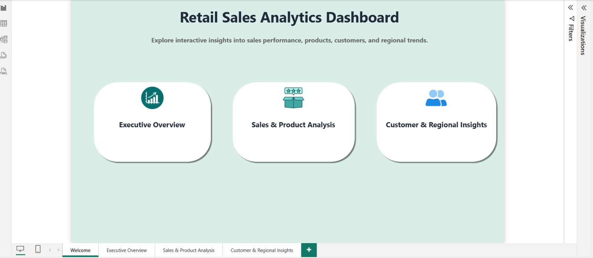
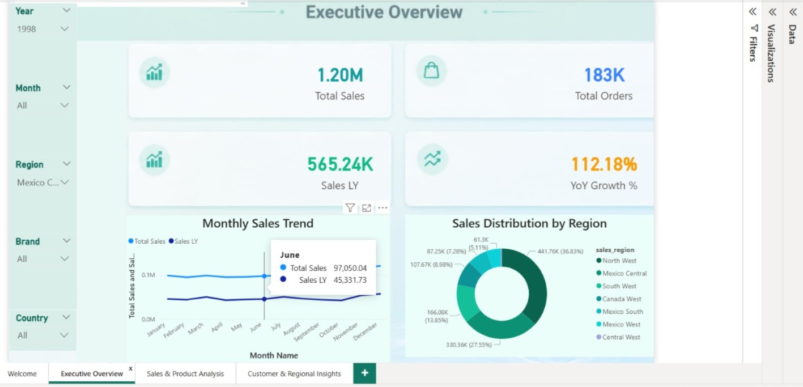
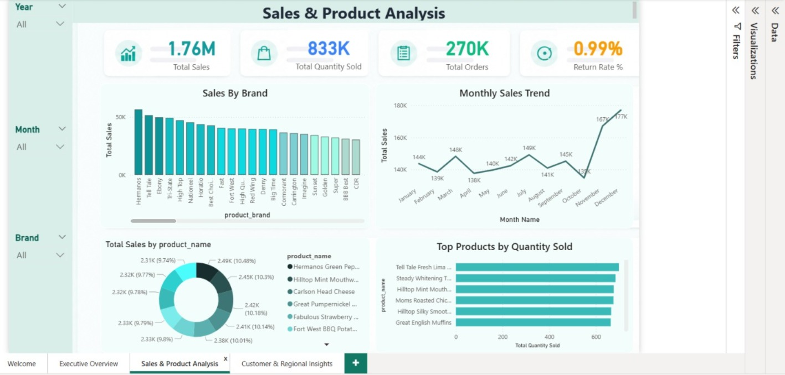
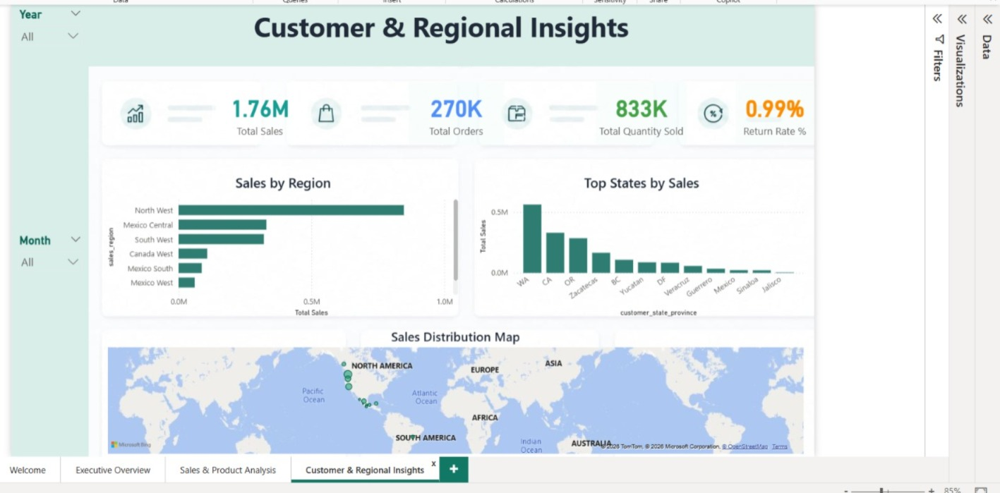

# 🛍️ Retail Sales Data Analysis

## 📌 Project Overview
This project analyzes retail sales data using SQL Server, Excel, Power Query, Power BI, and DAX to uncover business insights and support data-driven decision-making.

The project follows the complete data analysis workflow:
- Data Cleaning
- Data Transformation
- Data Modeling
- Data Analysis
- Dashboard Development
- Business Insights & Recommendations

---

## 🛠️ Tools & Technologies

- Power BI
- SQL Server
- SQL
- Excel
- Power Query
- DAX

---

## 📂 Project Files

- 📊 Retail Sales Dashboard.pbix
- 📑 Retail Sales Presentation.pptx
- 🗄 SQL Queries.sql
- 🖼 Dashboard Images

---

## 📈 Dashboard Features

- Total Sales
- Total Orders
- Total Quantity Sold
- Return Rate
- Sales Trend
- Sales by Category
- Sales by Region
- Top Products
- Customer Analysis
- Business Insights

---

## 🔍 Key Insights

- Identified top-performing products and categories.
- Analyzed sales trends over time.
- Evaluated regional performance.
- Measured return rate.
- Built interactive dashboards for decision-making.

---

## 📷 Dashboard Preview

## 🚀 Skills Demonstrated

- SQL Query Writing
- Data Cleaning
- ETL Process
- Data Modeling
- DAX Calculations
- Data Visualization
- Business Intelligence
- Dashboard Design

---

## 👩‍💻 Author

**Heba Wareth**

Aspiring Data Analyst passionate about transforming data into actionable insights.

GitHub:
https://github.com/hebawareth